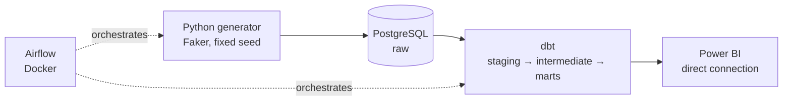
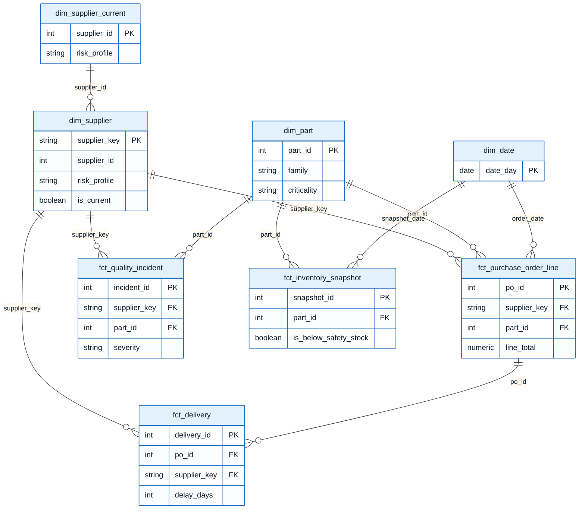
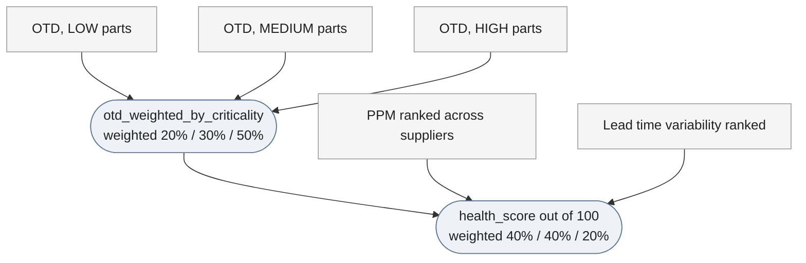
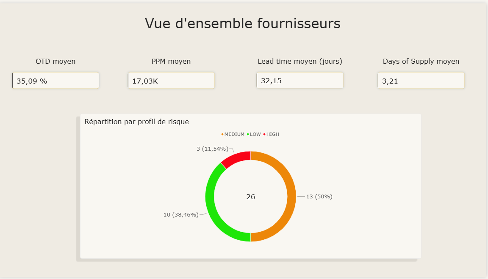
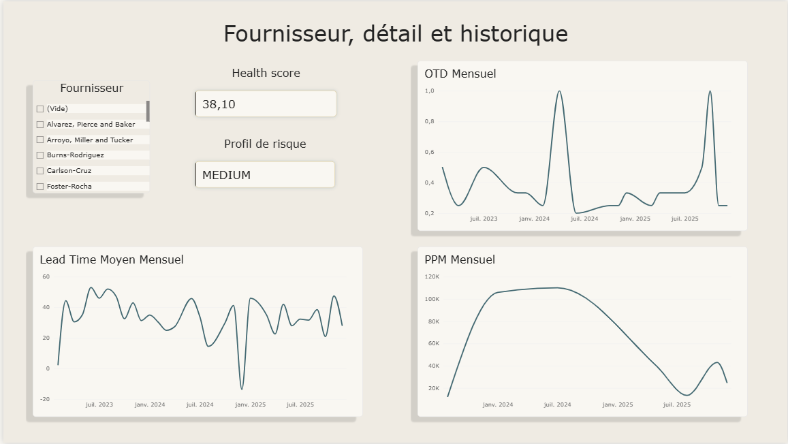

# Automotive Supplier Intelligence Platform (ASIP)

[🇫🇷 Français](README.md) | 🇬🇧 English

*Data Engineering core complete (generator, dbt, KPIs, Airflow, Power BI). Machine Learning bonus phase not started.*

## Table of contents

- [In short](#in-short)
- [Understanding this project in 2 minutes](#understanding-this-project-in-2-minutes-no-technical-jargon)
- [Architecture diagram](#architecture-diagram)
- [Generated data](#generated-data)
- [Data model (star schema)](#data-model-star-schema)
- [KPIs](#kpis)
- [Airflow orchestration](#airflow-orchestration)
- [Power BI dashboard](#power-bi-dashboard)
- [The most challenging part](#the-most-challenging-part-the-days-of-supply-drift)
- [Stack](#stack)
- [Getting started](#getting-started)
- [Project status](#project-status)
- [Next steps](#next-steps)
- [Extension ideas](#extension-ideas-out-of-scope-for-v1)
- [Further documentation](#further-documentation)

## In short

Supplier intelligence platform for a fictional automotive company (**ElectroMotion Automotive**). This is the 3rd project of a Data Engineering career-change portfolio, filling a gap left by the two previous ones: **relational/transactional data modeling** (star schema, SCD2, multi-fact ERP/procurement style), on a domain directly tied to real-world procurement/supplier experience.

The data and the company name are **entirely fictional**, with no link to confidential data from a real employer.

## Understanding this project in 2 minutes (no technical jargon)

**The problem this project solves**: in an automotive company, knowing in real time whether a supplier is delivering late, whether their parts have defects, or whether a stock is about to run out, normally requires manually cross-referencing several spreadsheets. This project automates all of that, from raw data to a dashboard you can check at a glance.

**What it does, concretely, on every run, with no human intervention:**

1. It generates a realistic dataset (suppliers, orders, deliveries, quality incidents, stock levels), with a few errors deliberately mixed in, just like a real company system
2. It cleans, transforms, and checks this data automatically (close to 90 quality checks)
3. It computes business indicators: does a supplier deliver on time? Do they have many defective parts? Is a stock at risk of running out? And an overall reliability score per supplier, weighted by the importance of the parts involved
4. All of this is orchestrated automatically (generation, transformation, verification), with no manual step
5. The results are then available in a visual dashboard, with the ability to drill down into a specific supplier and see how it evolved over time

**Why this is exactly what a Data Engineer does**: a company rarely needs raw data, it needs reliable, verified data turned into indicators it can act on. That's precisely what this project demonstrates.

**The link to my background**: after 10+ years in the automotive industry, including several years in component procurement (a portfolio worth over €100M), I wanted to build a project directly grounded in that experience: supplier performance tracking, a topic I already knew from the business side, tackled here from the data side.

## Architecture diagram



## Generated data

The Python generator (Faker, fixed seed) produces a reproducible dataset over the 2023-01-01 to 2025-12-31 period:

| Table | Volume |
|---|---|
| `suppliers` | 26 (including intentional duplicates) |
| `parts` | 40 |
| `purchase_orders` | 2,000 |
| `deliveries` | 2,307 (including partial deliveries) |
| `quality_incidents` | 162 |
| `inventory_snapshots` | 43,840 |

Deliberately injected anomalies (~4% of volume): duplicate suppliers, spelling variants of names, inconsistent dates, outlier prices, missing values. Caught by dbt tests (see the lineage graph below).

## Data model (star schema)

4 dimensions (including `dim_supplier` with SCD2 historization and `dim_supplier_current`, its current version used as a pivot) and 4 fact tables, produced through a 3-layer dbt pipeline (staging → intermediate → marts).



`supplier_key` (not `supplier_id`) is used as the foreign key in the fact tables: it's the SCD2 version key, pointing to the supplier version that was active at the fact's date (see [ADR-0004](docs/adr/0004-fallback-scd2-facts.en.md)). `dim_supplier_current` keeps only one row per supplier (current version): it acts as a pivot toward the KPI tables (already at the "one per supplier" grain), notably in Power BI, where a direct relationship from `dim_supplier` would have been ambiguous due to multiple versions.

### dbt documentation and lineage graph

dbt generates interactive documentation with a full lineage graph (raw → staging → intermediate → marts), viewable locally:

```bash
cd dbt
dbt docs generate
dbt docs serve
```

The project's actual lineage graph (generated from the 21 models and their dependencies):


## KPIs

5 business indicators, computed by dedicated dbt models (`models/marts/kpi_*.sql`): OTD, quality PPM, average lead time and variability (per supplier), Days of Supply (per part), and a composite Supplier Health Score.

### Supplier Health Score, in two steps

The score combines two levels of weighting, both configurable without touching any SQL (`dbt_project.yml`, variables `health_score_criticality_weights` and `health_score_kpi_weights`):

1. **OTD is first weighted by part criticality**: a delay on a critical part (HIGH) weighs more than a delay on a secondary part (LOW).
2. **This result is then combined with PPM and lead time variability** (both ranked relative to other suppliers, to stay comparable), to produce the final score out of 100.



## Airflow orchestration

A single DAG (`asip_pipeline`) orchestrates the pipeline end to end: data generation/ingestion, `dbt run`, `dbt test`, then publishing a KPI summary to the logs. Airflow runs locally via Docker (pinned image version, LocalExecutor, dedicated metadata database).

Actual DAG run, all 4 tasks successful:


## Power BI dashboard

Direct connection to PostgreSQL (DirectQuery, no import), 2 pages matching the original requirements.

**Executive**: supplier breakdown by risk profile, average OTD/PPM/lead time/Days of Supply.



**Supplier**: per-supplier drill-down (selector), Health Score, risk profile, and monthly OTD/PPM/lead time history.



## The most challenging part: the Days of Supply drift

While building the Power BI dashboard, a value jumped out at me: an average Days of Supply of **915 days** on some parts. The data generator was supposed to target about 15 days of stock coverage. Instead of just tweaking the number, I went looking for the real cause. It took three rounds.

**First issue found: daily consumption had no link to actual orders.** The generator was drawing a random number (2 to 15 units per day), while orders sometimes delivered up to 500 units at once. I fixed this by computing consumption from the volume actually delivered to each part. Result: the value drops to ~350 days. Better, but still not right.

**Second issue, more hidden: stock started too low and never managed to stabilize.** Very early in the simulation, the initial stock (15 days of coverage) would run out before the first large delivery even arrived. My code then capped the stock at 0, which silently erased consumption that should have happened. Meanwhile, each delivery kept adding its full amount. Over 3 years, this imbalance kept accumulating and never self-corrected. I fixed this by tracking a "theoretical" stock internally, allowed to go below 0 (representing a backorder, a standard practice in inventory simulation), and only displaying its version capped at 0. Result: the average drops to 3.2 days, finally consistent.

**Third issue, found right after, on a completely different KPI: PPM was showing spikes up to 10 million in Power BI.** Digging in, I found that the quality incidents table wasn't linked to any date in the Power BI model. So filtering by month correctly reduced the number of deliveries (the denominator), but not the number of incidents (the numerator), which stayed at the full 3-year total. I added the missing relationship, then a proper monthly grouping column in `dim_date`, since grouping day by day produced unstable ratios on small volumes.

What I take away from this: verify a hypothesis with a real SQL query before concluding anything, accept that a first fix might not be enough, and learn to tell a real bug apart from a normal statistical effect.

## Stack

| Area | Tools | Status |
|---|---|---|
| Data generation | Python, Faker (fixed seed, reproducible) | Done |
| Storage | PostgreSQL (Docker) | Done |
| Transformation | dbt (star schema, SCD2 on `dim_supplier`) | Done |
| Orchestration | Airflow (Docker, pinned image) | Done |
| Reporting | Power BI | Done |
| Machine Learning | Rule-based baseline + logistic regression | To do (bonus) |

*(AWS cloud track explicitly out of scope for v1, see [ADR-0001](docs/adr/0001-postgres-local-vs-cloud-demblee.en.md))*

## Getting started

```bash
git clone <repo>
cd automotive-supplier-intelligence
cp .env.example .env
```

Fill in `.env` with your own values (local passwords, and an Airflow Fernet key generated via `python -c "from cryptography.fernet import Fernet; print(Fernet.generate_key().decode())"`).

```bash
docker compose up -d --build
```

The pipeline can then be triggered in two ways:

- **Via Airflow** (recommended): open `http://localhost:8081` (credentials `AIRFLOW_ADMIN_USER`/`AIRFLOW_ADMIN_PASSWORD` from your `.env`), trigger the `asip_pipeline` DAG.
- **Locally, manually**: from a Python virtual environment with `pip install -r requirements.txt`, then:
  ```bash
  python -m data_generation.generate
  cd dbt && export DBT_PROFILES_DIR=$(pwd) && dbt run && dbt test
  ```

The Power BI dashboard (`.pbix`, not version-controlled) then connects to `localhost:5432` (database `asip`, schema `dbt_dev`) via DirectQuery.

## Project status

- Phases completed: 3/4 (data generator, dbt core with SCD2, KPIs + Airflow orchestration + Power BI dashboard)
- dbt models: 21 (staging, intermediate, marts)
- dbt tests: 90 (89 passing, 1 documented warning, see the Generated data section)
- ADRs written: 4

## Next steps

- ✅ **Week 1**: data generator, causal relationships, intentional anomalies
- ✅ **Week 2**: PostgreSQL, dbt core (staging/intermediate/marts), SCD2 on `dim_supplier`, tests
- ✅ **Week 3**: 5 KPIs including Supplier Health Score, Airflow orchestration, 2-page Power BI dashboard
- ⬜ **Week 4 (bonus)**: rule-based baseline, logistic regression, temporal validation

## Extension ideas (out of scope for v1)

- **Multi-plant consumption by country**: the current stock model simulates a single global daily consumption per part, with no geographic breakdown. A more realistic evolution would split consumption across several plants in different countries, each with its own pace. This would require introducing a plant entity, currently absent from the source data.
- **dim_plant**: initially planned in the requirements, this dimension was removed from the v1 scope, for lack of a source table carrying a plant concept (see [ADR-0003](docs/adr/0003-retrait-dim-plant.en.md)). It could come back if the multi-plant idea above is implemented.
- **SCD2 history on the facts**: `dim_supplier`'s SCD2 was only activated after the initial data generation (2023-2025), so historical facts all reference the supplier's current version rather than the one in effect at their actual date (see [ADR-0004](docs/adr/0004-fallback-scd2-facts.en.md)). A new fact generated after a `risk_profile` change will benefit from an exact temporal match.

## Further documentation

- [ADR-0001: Choosing local PostgreSQL over a cloud setup from the start](docs/adr/0001-postgres-local-vs-cloud-demblee.en.md)
- [ADR-0002: Deliberately minimal 6-table scope](docs/adr/0002-perimetre-six-tables.en.md)
- [ADR-0003: Removing dim_plant from the v1 scope](docs/adr/0003-retrait-dim-plant.en.md)
- [ADR-0004: Falling back to the current version for the SCD2 temporal join](docs/adr/0004-fallback-scd2-facts.en.md)
