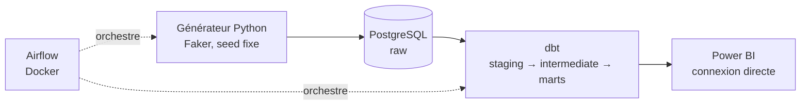
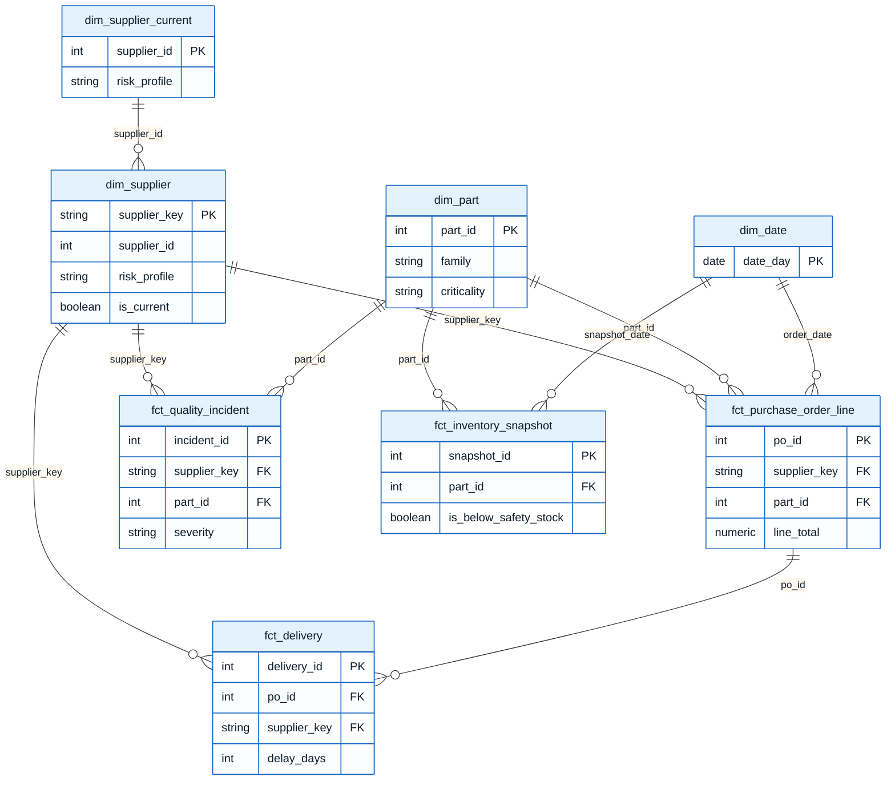

# Automotive Supplier Intelligence Platform (ASIP)

> ⚠️ Projet en cours de construction. Ce README sera mis à jour à chaque clôture de phase.

## En bref

Plateforme d'intelligence fournisseurs pour une entreprise automobile fictive (**ElectroMotion Automotive**). Ce projet est le 3ᵉ d'un portfolio de reconversion Data Engineering et couvre un trou volontairement laissé par les deux précédents : la **modélisation de données relationnelle/transactionnelle métier** (star schema, SCD2, multi-facts de type ERP/achats), sur un domaine directement lié à une expérience achats/fournisseurs.

Les données et le nom de l'entreprise sont **entièrement fictifs**, sans lien avec des données confidentielles d'un employeur réel.

## Comprendre ce projet en 2 minutes (sans jargon technique)

**Le problème que ce projet résout** : dans une entreprise automobile, savoir en temps réel si un fournisseur livre en retard, si ses pièces ont des défauts, ou si un stock risque de manquer, demande normalement de croiser plusieurs tableurs à la main. Ce projet automatise tout ça, de la donnée brute jusqu'à un tableau de bord consultable en un coup d'œil.

**Ce qu'il fait, concrètement, à chaque exécution, sans intervention humaine :**

1. Il génère un jeu de données réaliste (fournisseurs, commandes, livraisons, incidents qualité, niveaux de stock), avec volontairement quelques erreurs glissées dedans, comme dans un vrai système d'entreprise
2. Il nettoie, transforme et vérifie ces données automatiquement (près de 90 contrôles de qualité)
3. Il calcule des indicateurs métier : un fournisseur livre-t-il à l'heure ? A-t-il beaucoup de pièces défectueuses ? Un stock risque-t-il la rupture ? Et un score de fiabilité global par fournisseur, pondéré selon l'importance des pièces concernées
4. Tout ce travail est orchestré automatiquement (génération, transformation, vérification), sans étape manuelle
5. Les résultats sont ensuite consultables dans un tableau de bord visuel, avec la possibilité de zoomer sur un fournisseur précis et voir son évolution dans le temps

**Pourquoi c'est exactement le métier de Data Engineer** : une entreprise n'a pas besoin de données brutes, elle a besoin de données fiables, vérifiées, et transformées en indicateurs sur lesquels elle peut agir. C'est précisément ce que ce projet démontre.

**Le lien avec mon parcours** : après plus de 10 ans dans l'industrie automobile, dont plusieurs années aux achats de composants (portefeuille de plus de 100 millions d'euros), j'ai voulu construire un projet directement ancré dans cette expérience : le suivi de la performance fournisseurs, un sujet que je connaissais déjà côté métier, abordé ici côté données.

## Schéma d'architecture



## Données générées

Le générateur Python (Faker, seed fixe) produit un jeu de données reproductible sur la période 2023-01-01 à 2025-12-31 :

| Table | Volume |
|---|---|
| `suppliers` | 26 (dont doublons volontaires) |
| `parts` | 40 |
| `purchase_orders` | 2 000 |
| `deliveries` | 2 307 (dont livraisons partielles) |
| `quality_incidents` | 162 |
| `inventory_snapshots` | 43 840 |

Anomalies injectées volontairement (~4 % du volume) : doublons fournisseurs, variantes orthographiques de noms, dates incohérentes, prix aberrants, valeurs manquantes. Détectées par les tests dbt (voir le graphe de lignage ci-dessous).

## Modèle de données (star schema)

4 dimensions (dont `dim_supplier` avec historisation SCD2 et `dim_supplier_current`, sa version courante utilisée comme pivot) et 4 tables de faits, obtenues via un pipeline dbt en 3 couches (staging → intermediate → marts).



`supplier_key` (et non `supplier_id`) est utilisé comme clé étrangère dans les faits : c'est la clé de version SCD2, qui pointe vers la version du fournisseur active à la date du fait (voir [ADR-0004](docs/adr/0004-fallback-scd2-facts.md)). `dim_supplier_current` ne garde qu'une ligne par fournisseur (version actuelle) : elle sert de pivot vers les tables de KPI (déjà au grain "un par fournisseur"), notamment dans Power BI, où une relation directe depuis `dim_supplier` aurait été ambiguë du fait des versions multiples.

### Documentation dbt et graphe de lignage

dbt génère une documentation interactive avec un graphe de lignage complet (raw → staging → intermediate → marts), consultable en local :

```bash
cd dbt
dbt docs generate
dbt docs serve
```

Le graphe de lignage réel du projet (généré à partir des 21 modèles et de leurs dépendances) :


## KPI calculés

5 indicateurs métier, calculés par des modèles dbt dédiés (`models/marts/kpi_*.sql`) : OTD, PPM qualité, lead time moyen et variabilité (par fournisseur), Days of Supply (par pièce), et un Supplier Health Score composite.

### Supplier Health Score, en deux étapes

Le score combine deux niveaux de pondération, tous deux configurables sans toucher au SQL (`dbt_project.yml`, variables `health_score_criticality_weights` et `health_score_kpi_weights`) :

1. **L'OTD est d'abord pondéré par criticité des pièces** : un retard sur une pièce critique (HIGH) pèse plus lourd qu'un retard sur une pièce secondaire (LOW).
2. **Ce résultat est ensuite combiné avec le PPM et la variabilité du lead time** (tous deux classés par rang relatif entre fournisseurs, pour rester comparables), afin d'obtenir le score final sur 100.


## Orchestration Airflow

Un DAG unique (`asip_pipeline`) orchestre le pipeline de bout en bout : génération/ingestion des données, `dbt run`, `dbt test`, puis publication d'un résumé des KPI dans les logs. Airflow tourne en local via Docker (image versionnée, LocalExecutor, base de métadonnées dédiée).

Exécution réelle du DAG, les 4 tâches en succès :


## Dashboard Power BI

Connexion directe à PostgreSQL (DirectQuery, pas d'import), 2 pages conformes au cahier des charges.

**Executive** : répartition des fournisseurs par profil de risque, OTD/PPM/lead time/Days of Supply moyens.


**Fournisseur** : drill-down par fournisseur (sélecteur), Health Score, profil de risque, et historique mensuel OTD/PPM/lead time.


## Le chantier le plus formateur : la dérive du Days of Supply

En construisant le dashboard Power BI, une valeur m'a sauté aux yeux : un Days of Supply moyen de **915 jours** sur certaines pièces. Le générateur de données visait pourtant une couverture de stock d'environ 15 jours. Plutôt que de bidouiller le chiffre, j'ai cherché la vraie cause. Il m'a fallu trois allers-retours.

**Premier problème trouvé : la consommation journalière n'avait aucun lien avec les commandes réelles.** Le générateur tirait un chiffre au hasard (2 à 15 unités par jour), pendant que les commandes livraient parfois jusqu'à 500 unités d'un coup. J'ai corrigé ça en calculant la consommation à partir du volume vraiment livré à chaque pièce. Résultat : la valeur descend à ~350 jours. Mieux, mais toujours pas bon.

**Deuxième problème, plus caché : le stock partait de trop bas et n'arrivait jamais à se stabiliser.** En tout début de simulation, le stock initial (15 jours de couverture) s'épuisait avant même la première grosse livraison. Mon code plafonnait alors le stock à 0, ce qui effaçait silencieusement de la consommation. Pendant ce temps, chaque livraison continuait d'ajouter son montant complet. Sur 3 ans, ce déséquilibre s'accumulait sans jamais se corriger tout seul. J'ai résolu ça en suivant un stock "théorique" en interne, qui peut descendre sous 0 (ça représente une rupture, une pratique courante en simulation de stock), et je n'affiche que sa version plafonnée à 0. Résultat : la moyenne tombe à 3.2 jours, enfin cohérent.

**Troisième problème, découvert juste après, sur un tout autre KPI : le PPM affichait des pics jusqu'à 10 millions dans Power BI.** En cherchant, j'ai vu que la table des incidents qualité n'était reliée à aucune date dans le modèle Power BI. Du coup, filtrer par mois réduisait bien le nombre de livraisons (le dénominateur), mais pas le nombre d'incidents (le numérateur), qui restait celui de 3 années entières. J'ai ajouté la relation manquante, puis une vraie colonne de regroupement mensuel dans `dim_date`, parce que regrouper jour par jour donnait des ratios instables sur de petits volumes.

Ce que je retiens de ce chantier : vérifier une hypothèse avec une vraie requête SQL avant de conclure quoi que ce soit, accepter qu'une première correction ne suffise pas toujours, et apprendre à distinguer un vrai bug d'un phénomène statistique normal.

## Stack


- **Génération de données** : Python, Faker (seed fixe, reproductible)
- **Stockage** : PostgreSQL (Docker)
- **Transformation** : dbt (star schema, SCD2 sur `dim_supplier`)
- **Orchestration** : Airflow (Docker, image versionnée)
- **Restitution** : Power BI

*(Volet cloud AWS explicitement hors périmètre v1, voir [ADR-0001](docs/adr/0001-postgres-local-vs-cloud-demblee.md))*

## Démarrage

```bash
git clone <repo>
cd automotive-supplier-intelligence
cp .env.example .env
```

Complète `.env` avec tes propres valeurs (mots de passe locaux, et une clé Fernet Airflow générée via `python -c "from cryptography.fernet import Fernet; print(Fernet.generate_key().decode())"`).

```bash
docker compose up -d --build
```

Le pipeline peut ensuite être déclenché de deux façons :

- **Via Airflow** (recommandé) : ouvre `http://localhost:8081` (identifiants `AIRFLOW_ADMIN_USER`/`AIRFLOW_ADMIN_PASSWORD` de ton `.env`), déclenche le DAG `asip_pipeline`.
- **En local, manuellement** : depuis un environnement virtuel Python avec `pip install -r requirements.txt`, puis :
  ```bash
  python -m data_generation.generate
  cd dbt && export DBT_PROFILES_DIR=$(pwd) && dbt run && dbt test
  ```

Le dashboard Power BI (`.pbix`, non versionné) se connecte ensuite à `localhost:5432` (base `asip`, schéma `dbt_dev`) en DirectQuery.

## État du projet

- Phases terminées : 3/4 (générateur de données, socle dbt avec SCD2, KPI + orchestration Airflow + dashboard Power BI)
- Modèles dbt : 21 (staging, intermediate, marts)
- Tests dbt : 90 (89 passants, 1 avertissement documenté, voir la section Données générées)
- ADR rédigés : 4

## Pistes d'extension (hors périmètre v1)

- **Consommation multi-usines par pays** : le modèle de stock actuel simule une consommation quotidienne globale par pièce, sans distinction géographique. Une évolution réaliste consisterait à répartir la consommation entre plusieurs usines localisées dans différents pays, avec des cadences propres à chaque site. Nécessiterait l'introduction d'une entité plant/usine, aujourd'hui absente des données sources.
- **dim_plant** : initialement prévue dans le cahier des charges, cette dimension a été retirée du périmètre v1, faute de table source portant une notion d'usine (voir [ADR-0003](docs/adr/0003-retrait-dim-plant.md)). Elle pourrait revenir si la piste multi-usines ci-dessus est concrétisée.
- **Historique SCD2 sur les facts** : le SCD2 de dim_supplier n'a été activé qu'après la génération initiale des données (2023-2025), donc les facts historiques référencent tous la version actuelle du fournisseur plutôt que celle en vigueur à leur date réelle (voir [ADR-0004](docs/adr/0004-fallback-scd2-facts.md)). Un nouveau fait généré après un changement de risk_profile bénéficiera d'une correspondance temporelle exacte.

## Documentation approfondie

- [ADR-0001 : Choix de PostgreSQL local plutôt qu'un socle cloud d'emblée](docs/adr/0001-postgres-local-vs-cloud-demblee.md)
- [ADR-0002 : Périmètre volontairement minimal de 6 tables](docs/adr/0002-perimetre-six-tables.md)
- [ADR-0003 : Retrait de dim_plant du périmètre v1](docs/adr/0003-retrait-dim-plant.md)
- [ADR-0004 : Fallback vers la version courante pour la jointure temporelle SCD2](docs/adr/0004-fallback-scd2-facts.md)
