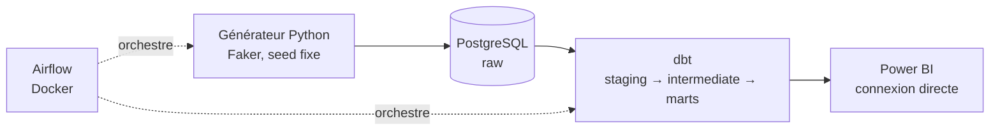

# Automotive Supplier Intelligence Platform (ASIP)

> ⚠️ Projet en cours de construction. Ce README sera mis à jour à chaque clôture de phase.

## En bref

Plateforme d'intelligence fournisseurs pour une entreprise automobile fictive (**ElectroMotion Automotive**). Ce projet est le 3ᵉ d'un portfolio de reconversion Data Engineering et couvre un trou volontairement laissé par les deux précédents : la **modélisation de données relationnelle/transactionnelle métier** (star schema, SCD2, multi-facts de type ERP/achats), sur un domaine directement lié à une expérience achats/fournisseurs.

Les données et le nom de l'entreprise sont **entièrement fictifs**, sans lien avec des données confidentielles d'un employeur réel.

## Schéma d'architecture



## Stack

- **Génération de données** : Python, Faker (seed fixe, reproductible)
- **Stockage** : PostgreSQL (Docker)
- **Transformation** : dbt (star schema, SCD2 sur `dim_supplier`)
- **Orchestration** : Airflow (Docker, image versionnée)
- **Restitution** : Power BI

*(Volet cloud AWS explicitement hors périmètre v1, voir [ADR-0001](docs/adr/0001-postgres-local-vs-cloud-demblee.md))*

## Démarrage

```bash
git clone <repo>
cd automotive-supplier-intelligence
docker compose up
```

## État du projet

- Phases terminées : 0/4
- Tests dbt : 0
- ADR rédigés : 4

## Pistes d'extension (hors périmètre v1)

- **Consommation multi-usines par pays** : le modèle de stock actuel simule une consommation quotidienne globale par pièce, sans distinction géographique. Une évolution réaliste consisterait à répartir la consommation entre plusieurs usines localisées dans différents pays, avec des cadences propres à chaque site. Nécessiterait l'introduction d'une entité plant/usine, aujourd'hui absente des données sources.
- **dim_plant** : initialement prévue dans le cahier des charges, cette dimension a été retirée du périmètre v1, faute de table source portant une notion d'usine (voir [ADR-0003](docs/adr/0003-retrait-dim-plant.md)). Elle pourrait revenir si la piste multi-usines ci-dessus est concrétisée.
- **Historique SCD2 sur les facts** : le SCD2 de dim_supplier n'a été activé qu'après la génération initiale des données (2023-2025), donc les facts historiques référencent tous la version actuelle du fournisseur plutôt que celle en vigueur à leur date réelle (voir [ADR-0004](docs/adr/0004-fallback-scd2-facts.md)). Un nouveau fait généré après un changement de risk_profile bénéficiera d'une correspondance temporelle exacte.

## Documentation approfondie

- [ADR-0001 : Choix de PostgreSQL local plutôt qu'un socle cloud d'emblée](docs/adr/0001-postgres-local-vs-cloud-demblee.md)
- [ADR-0002 : Périmètre volontairement minimal de 6 tables](docs/adr/0002-perimetre-six-tables.md)
- [ADR-0003 : Retrait de dim_plant du périmètre v1](docs/adr/0003-retrait-dim-plant.md)
- [ADR-0004 : Fallback vers la version courante pour la jointure temporelle SCD2](docs/adr/0004-fallback-scd2-facts.md)
